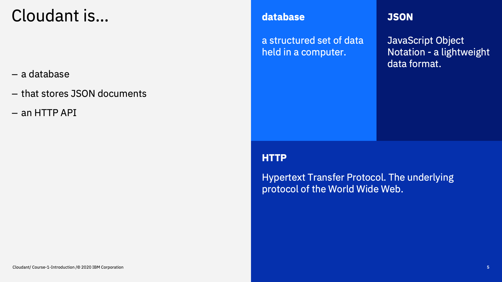
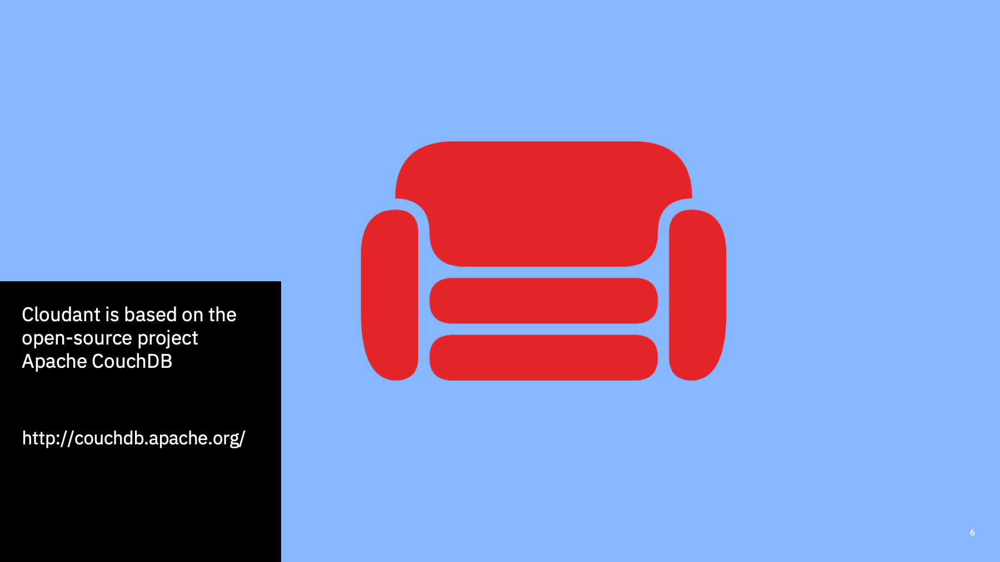
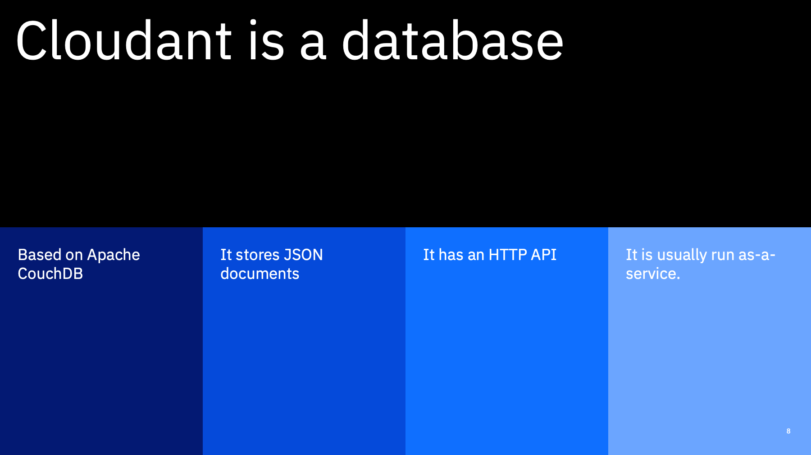

Welcome to the Introduction to Cloudant course, an eighteen part video series that gives you an overview of the IBM Cloudant databases-as-a-service.

---

This is part 1: "What is Cloudant?"

--- 

Cloudant is a database, run as a service in the IBM Cloud. Its job is to store your application's data securely and allow you to retrieve it quickly and efficiently. Cloudant's key features are that it is 

- a database - it stores and retrieves data
- more specifically it is a JSON document store. JSON comes from JavaScript and represents simple objects in a universal file format. The "document" is the unit of storage in Cloudant. Documents are added/updated/deleted in their entirety.
- It has an HTTP API. Any Cloudant operation can be achieved using HTTP. HTTP is the protocol that powers the World Wide Web and Cloudant is a  database built for the web.

Most databases are hidden in a private network, inaccessible but to a handful of machines but the Cloudant service sits (mainly) on the public internet where it be accessed by anyone with an internet connection (and permission to do so!).

---

Cloudant wasn't written entirely by IBM. It is based on Apache CouchDB, an open source project run by the Apache Foundation. Cloudant employs a number of CouchDB contributors but by the rules of Apache, they cannot monopolise its development.

Much of what you see in this course is applicable to Apache CouchDB as it is to Cloudant. Their APIs are 99% the same - I'll point out where they diverge.

Cloudant can be thought of as CouchDB run "as-a-service". A Cloudant service is easily deployed and is managed by IBM engineers 24-7. There's no software to install, no servers to manage, no configuration to understand. The user need not be a CouchDB expert to use and manage it.

Cloudant being built on truly open-source foundations means that you can be sure that your data layer is not _locked in_ to a particular platform, cloud or vendor and Cloudant can be used in concert with CouchDB to create hybrid applications that share data through replication, as we'll see.

---

Later on in the course we'll look "under the hood, to see how Cloudant works, but initially we'll treat Cloudant as a "black box".

---

To summarise

- Cloudant is based on Apache CouchDB, an open-source project.
- it stores JSON documents.
- it is accessed with an HTTP API and can therefore be accessed by any device on the internet that speaks HTTP: application code, web browser, IoT device or mobile phone.
- Cloudant is a highly-available managed service able to continue to operate with multiple hardware failures

---

That's the end of this part. The next part is called ["The Document"](Part 02 - The Document.md)
 

---

 

