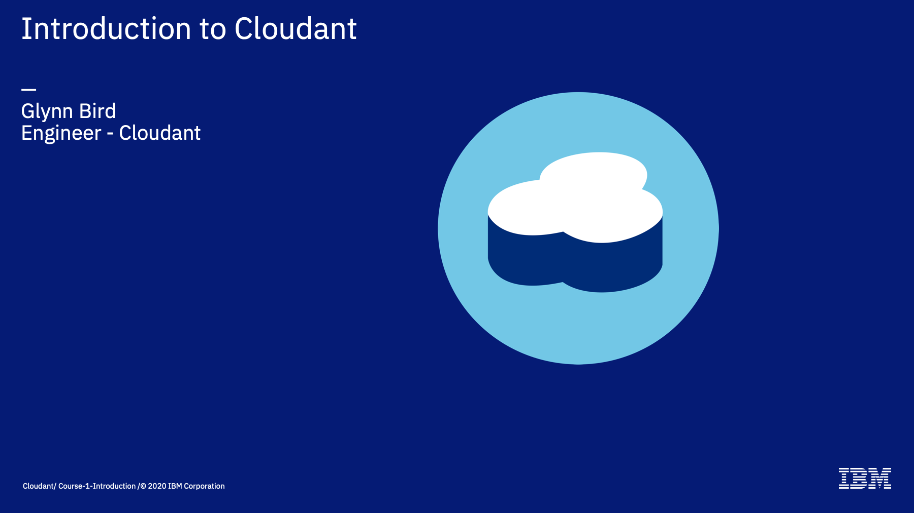

Welcome to the Introduction to Cloudant course, an eighteen part video series that gives you an overview of the IBM Cloudant databases-as-a-service.

---

This is part 2: "The Cloudant Document?"

We've seen that Cloudant is a JSON document store. Let's find out what that means in practice and how that compares to other types of database.

--- 

Most databases store their data in collections called _tables_, where each unit of data is a _row_, each with identical, fixed columns. The schema of each table is predefined: a list of columns with their name, date type, value constraints and relations to other tables carefully defined. Each new record forms a row in a table. 

Cloudant is quite different!

A Cloudant service has collections called _databases_ (instead of _tables_) each of which containing any number of documents. 

The example on this slide shows the same data expressed in a traditional tabular database and how the same data would be stored in Cloudant as JSON documents. 

So if you come from a relational database background: tables are "databases" in Cloudant, and rows are "documents".

---

A Cloudant document must be a JSON object, starting and ending with curly braces and containing a number of key/value attributes.

JSON objects must be less that 1 megabyte in size and contain any number of strings, numbers, booleans, arrays and objects. The nesting of objects within objects can continue to any depth.

The keys used can be as brief or verbose as you like.

Here are some simple example documents showing how each data type is used.

- the first example shows a person object, storing strings, booleans, and an array of tags.
- the second example shows very brief attribute names, to save on storage and represents a web event such as a click on a website.
- the last example shows how the document may itself contain sub-objects

A note on dates. JSON has no native Date type so dates are usually stored in 2018-10-30 or similar formats - we will come back to dates later.

---

Now for your first practical exercise. Visit www.ibm.com/cloud and register an account with the IBM Cloud, if you don't have one already.

One registered, you may click on "services", search for the "Cloudant" database and provision a new service.

The Cloudant "Lite" service provides a free plan to allow users to try Cloudant in a limited capacity while in development. Its bigger brother, the "Standard Plan", is paid-for service where you specify the number of reads/writes/and queries per second your application and that capacity is reserved for you. You pay for the capacity you provision and your data storage usage.

The Lite plan operates in a similar way, but only has a small provisioned capacity and a fixed storage size, but is fine for "kicking the tyres".

---

Cloudant is often referred to as a "schemaless" database - but we have to be careful how we define that term.

It's true to say that there's no need to define your schema (field names, types, constraints and relationships) ahead of time in a Cloudant database - you may simply write a JSON document of your own design  to a database. 

This flexibility is well liked by developers because they can design their data in their code, turn it into JSON and write it to the database. 

It's still important to think about the "shape of your data", especially in terms of how you are going to query and index it, as we'll see later. 

Data design is still required, but strictly speaking that database doesn't need to know about your schema.

---

Let's say we want to create a database of US presidents. We can simply devise our "model" of the data in our app, turn it into JSON and write it to the database. In this case we are using a common CouchDB convention: the "type" field indicating the data type of the document. 

---

If at a future date we decide we want to add additional data to our "schema", we can simply write a new object to the database with no complaints from Cloudant. We could decide to add the "address" object only to:

- documents that are created from now on
- only documents that we know addresses for

In other words, documents of the same type can have fields present or missing. 

You database's schema can evolve over time to match your application's needs and you don't (necessarily) need to tell the database about the schema change - just write new documents in the new format.

---

We can even store multiple document "types" in the same database.  In this case, people/books/places reside in the same database. We know which is which because of the "type" field (this is a convention and not something that means anything to Cloudant).

An alternative to this is have three databases people/books/places and keep each data type in its own database. Both approaches are fine: you would choose to have multiple types together in the same database if need to perform queries _across types_ or if you need to replicate all data types together, otherwise the _separate databases_ approach may be better.

---

To summarise:

Although Cloudant is "schemaless", this doesn't absolve you of the need to do detailed data design to get the best performance.

Here are some tips, especially relevant if you have some relational database experience.

- avoid thinking in joins - a Cloudant document should contain everything you need about that object, so that it can be retrieved in one API call.
- normalisation goes out of the window in JSON store, some repeated values can be tolerated if it makes data retrieval more efficient.
- although we have a 1MB limit on document size, your documents should be much smaller than that - a few KB is typical.
- If your application can embrace a "write only" design pattern, where data is only ever added to a database, then it may make your life easier. You should definitely avoid patterns that rely on updating the same document over and over in small time window.

---

That's the end of this part. The next part is called ["The Document id"](./Part&#32;03&#32;-&#32;The&#32;Document&#32;_id)
 

---