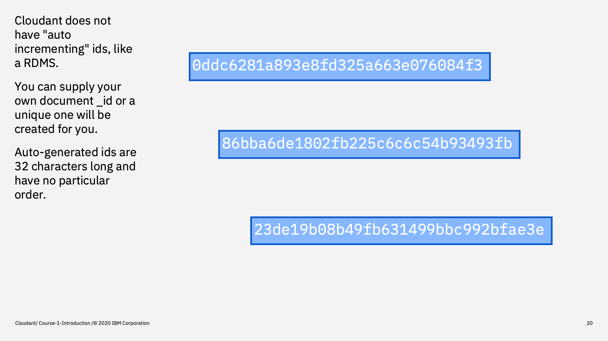
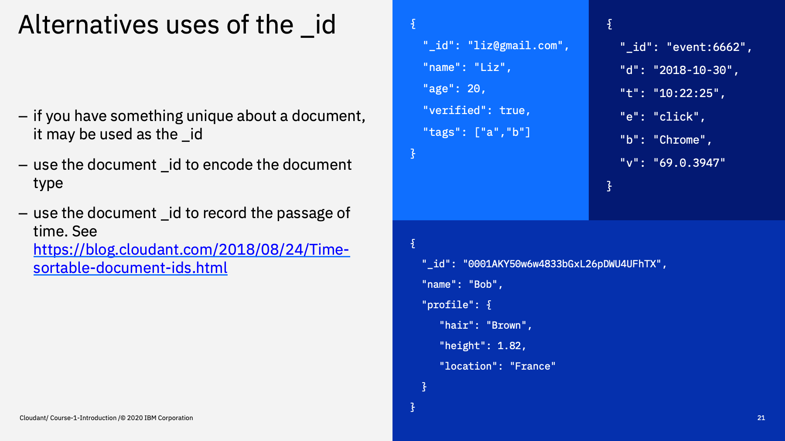
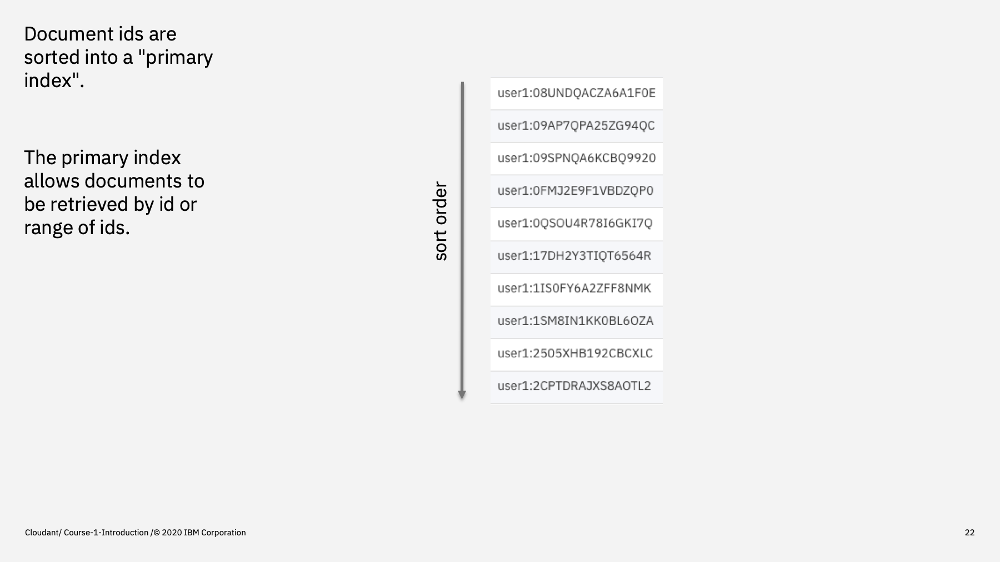

Welcome to the Introduction to Cloudant course, an eighteen part video series that gives you an overview of the IBM Cloudant databases-as-a-service.

---

This is part 3: "The Document _id"

We've seen how data is stored in Cloudant documents with flexibility on how your application stores JSON objects in Cloudant databases. There are, however, a few hard and fast rules.

--- 

One rule is that every document must have a unique identifier called `_id` which is a string. No two documents in the same database can have the same `_id` field. In other databases, you specify which column is the unique identifier, but in Cloudant it's always `_id` and can't be changed.

---

Also, unlike relational databases, Cloudant does not have "auto incrementing ids", that is an id field that starts at 1 and increments for each document added.

Cloudant's `_id` field is either:

- a 32 character string generated by Cloudant - the id is a meaningless sequence of numbers and letters that is guaranteed to be unique. or, 
- a string defined by you (if you know something unique about your data)

---

Here are some examples of supplying your own document _id :

1. using it to store something that you know is unique i.e. the email address of a user. Your registration mechanism can enforce a one-user-per-email address policy.
2. Some users choose to encode the document type in the `_id` e.g. user:56, book:55
3. The last example shows using a 32-digit string (generated in your app) that is designed to sort in approximate date/time order, making it easy to retrieve the latest documents from the database, without a secondary index.

---

Cloudant takes your document `_ids` and stores them in an index (like the contents page of book). This primary index is in `_id` order and is used to allow Cloudant to retrieve documents by their `_id` - thus behaving like a key/value store.

By careful design of your `_id` field, you can make use to the primary index to keep data that makes sense to be together in the primary index, making it quicker to retrieve that data later. We've already seen that using time-sortable `_id`s means that data can be retrieved in approximate date/time order.

We'll see this later when it comes to retrieving ranges of document ids.

---

In conclusion, each document must have a `_id` field that is unique in the database. It can be auto-generated by Cloudant, or can be supplied by your application, in which case you must take responsibility of the uniqueness of the `_id` field.

The `_id` field is the basis of the database's primary index which, as we'll see, can be used for key/value lookups and range queries.

---

That's the end of this part. The next part is called ["The rev token"](./Part&#32;04&#32;-&#32;The&#32;rev&#32;token.md)
 

---