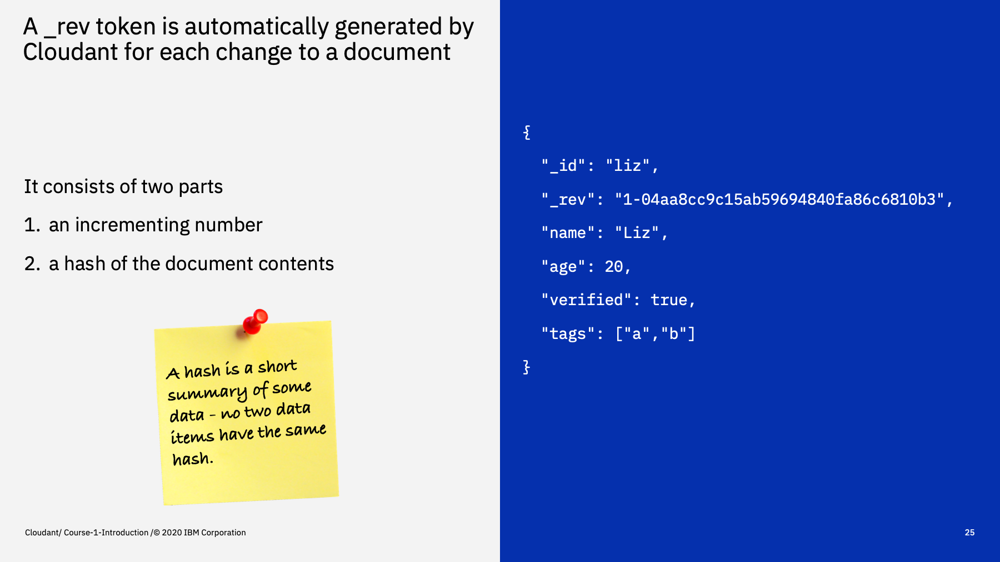
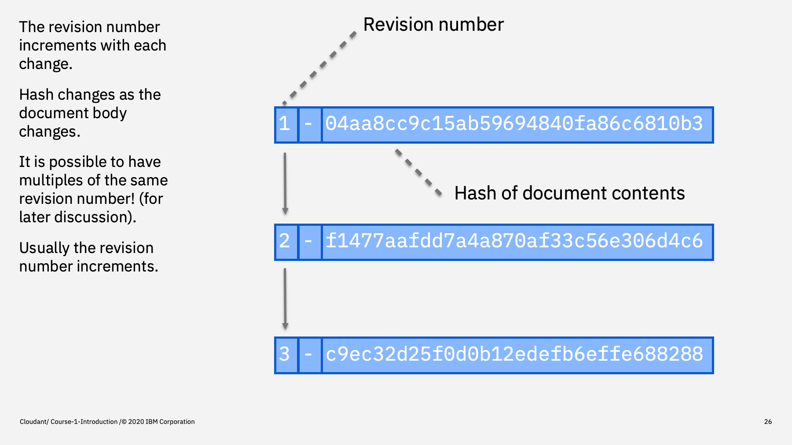
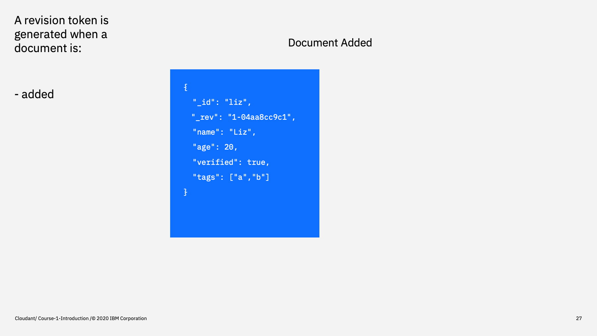
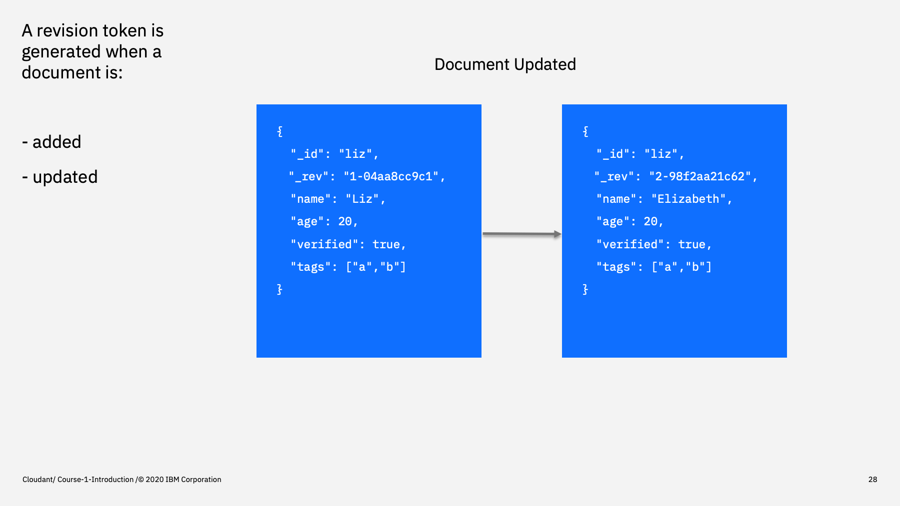
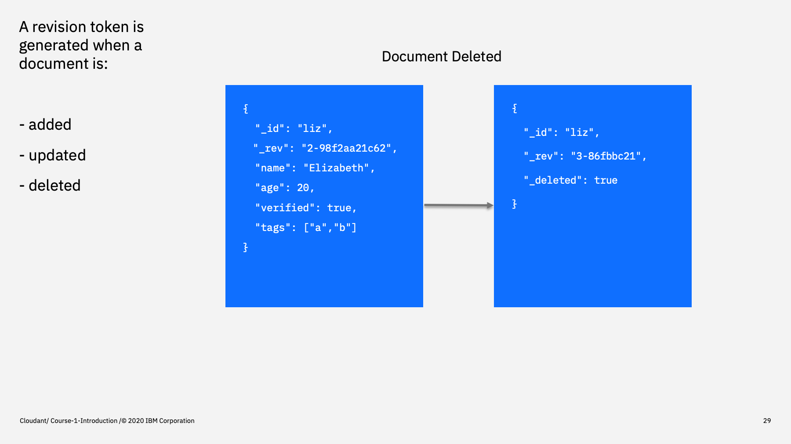
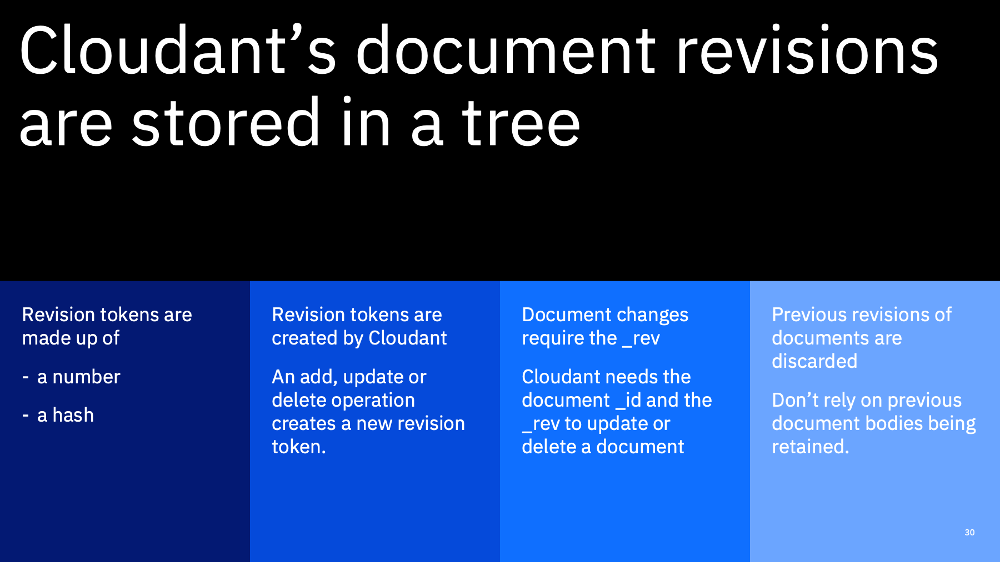

Welcome to the Introduction to Cloudant course, an eighteen part video series that gives you an overview of the IBM Cloudant databases-as-a-service.

---

This is part 4: "The rev token"

The second fundamental Cloudant rule is that each document revision is given its own unique revision token. Let's find out what it means.

---

You never need to generate a revision token - one is created for you when you add, update or delete a document using the API.

A revision token consists of two parts:

- a number 1, 2, 3, etc, and
- a cryptographic hash of the document's body

(For the uninitiated, a hash is a digital "fingerprint" of some data. If the data changes, the fingerprint changes. No two fingerprints are the same i.e. no two documents with different content would have the same hash.)

You can see from the example on the right that our document has a revision token (the key starting `_rev`) that starts with a "1" followed  by a dash. That tells us that this is the first revision of the document. The digits starting 04aa8... are the cryptographic hash of the document.

---

If we follow the lifecycle of a document, it starts with a "revision 1". When it is modified later, it gets a "revision 2" and so on. With each incrementing revision number, the hash also changes because the content of the document is being modified too.

One thing to note:

> It is *possible* for a document to have more than one revisions with the same number. i.e. two "revision 3s". This is called  a "conflict" and is "normal" in some circumstances. We'll see why later in the course, but for now we can assume that the revision number will increment with each update to a document.

--- 

Let's follow the lifecycle of an example Cloudant document

When  a new document is created (whether with an auto-generated `_id` or user-supplied `_id`), it is allocated a "revision 1". You will be sent the token in the response to your API request. Normally you can discard the `rev` (UNLESS you intend to modify the document in the near future, as we'll see).

--- 

When we modify a document  whose `_rev` is at "revision 1" (notice we've changed the name in the document from Liz --> Elizabeth), the document is saved and a "revision 2" token is generated and returned to you in the API response.

All simple enough so far.

--- 

If we delete the document later, A "revision 3" is created !

Unlike almost any other database, Cloudant keeps a reference for deleted documents. A deletion is just another document revision - a special one where `_deleted: true` replaces the document body.

In fact the document's recent revision history (the tree of revisions - remember we could have more than one of each revision number) - is kept.

Note

> You can't use Cloudant's revision tree as a   version control system to retrieve or "rollback" to an older revision. Once a revision is superceded, the document _body_ of the older revision is deleted and its disk space recovered in a process called "compaction". Compaction occurs automatically in Cloudant, so it's not safe to assume that old revisions will be available to be retrieved. 

--- 

To summarise:

- revision tokens are generated by the database on add/edit/delete. (you never need to create your own revision tokens).
- generally, the revision number increases by one each time, but more complex scenarios are possible (we'll cover this later).
- older document bodies are discarded or _compacted_ (don't rely on being able to get them back).
- all Cloudant operations that change a document need the document's `_id` AND its `_rev` (this is unlike most databases)

--- 

That's the end of this part. The next part is called ["Authentication"](./Part&#32;05&#32;-&#32;Authentication.md)
 

---