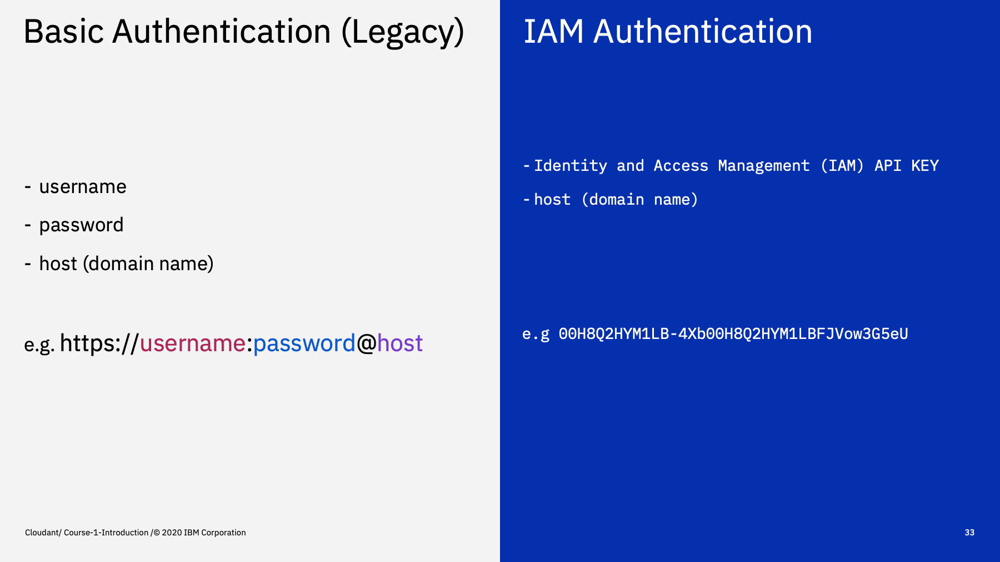
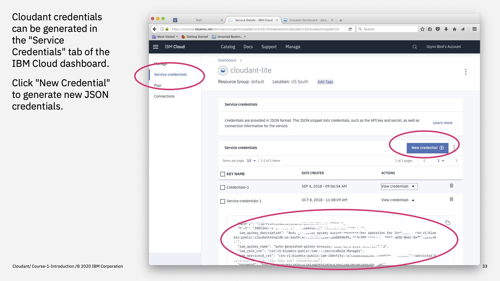
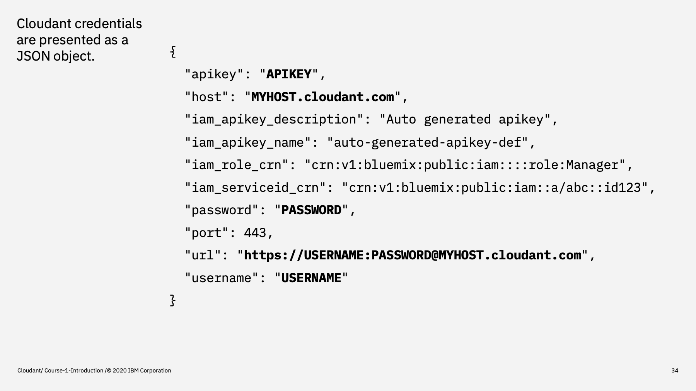
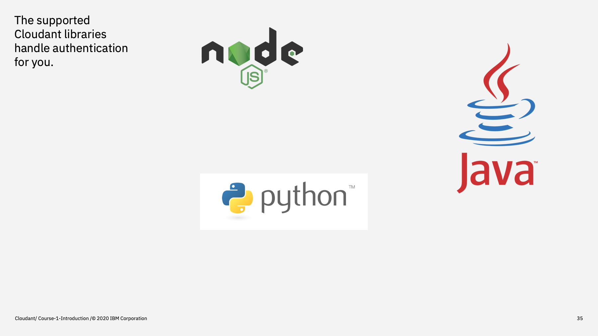
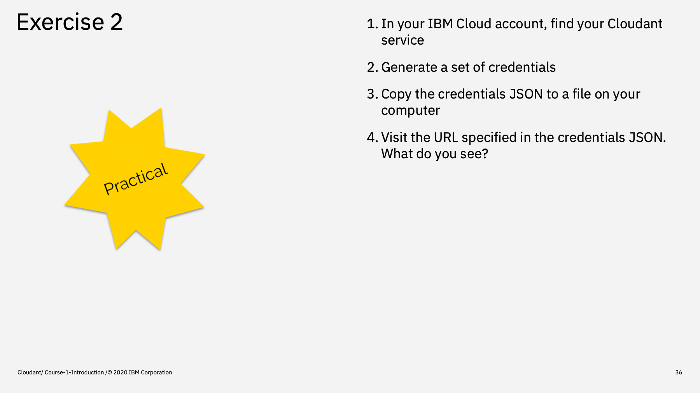
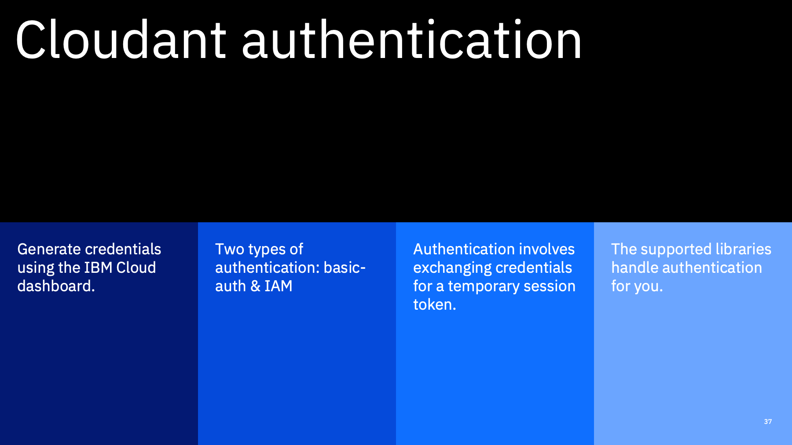

Welcome to the Introduction to Cloudant course, an eighteen part video series that gives you an overview of the IBM Cloudant databases-as-a-service.

---

This is part 5: "Authentication"

We said earlier that Cloudant is a web-based service on the public internet. How can we be sure that our data is safe and that only our code can access it? This is where _authentication_ comes in.

---

Cloudant supports two types of authentication. 

1. Legacy authentication is where are either supplied with each request using _HTTP Basic Authentication_ or exchanged for cookie, using a one-off `session` API call. The cookie is cycled regularly, so you client code needs to capture a refreshed cookie and stored for subsequent request.
2. IAM authentication is the access management system that powers all of the IBM Cloud services. To authenticate with IAM, you need the IAM API key and the host name of the Cloudant service. The API key is exchanged for a _bearer token_ using the IAM API and bearer token is passed to Cloudant with each request. The _bearer token_ only lasts for an hour, so must be renewed using the IAM service periodically.

When a Cloudant service is provisioned, you can generate _IAM only_ credentials or both _IAM_ and _Legacy_ credentials or Both - you decide.

---

How are credentials generated? 

In the IBM Cloud dashboard under your Cloudant service, in the "Service Credentials" tab, click the "New Credential" button and a JSON document containing the IAM key and the basic auth username/password and the Cloudant hostname is created.

---

Here's an example set of credentials:

- for IAM you need the top two bits: apikey & host
- for Legacy/Basic-Auth you need the URL (which contains the username and password embedded in the URL)

---

There are three official Cloudant libraries: Java, Node.js & Python.

All three handle authentication automatically. You don't need to worry about how it exchanges the API key for a session token or IAM authentication works - it's handled for you.

When we look at the API from the command-line, we'll be using Basic Auth as a convenience, but it's recommended you use IAM authentication if possible as it allows better integration with the IBM Cloud platform and finer-grained permissions.

---

Time for our next practical exercise.

Log into the IBM Cloud and locate the IBM Cloudant Lite service we created last time. In the "Service Credentials" tab, click "New Credential" button to generate a set of "IAM+Legacy" credentials. Make a note of the JSON it returns - we'll need that for the next exercise.

Then visit the URL specified in the credentials JSON - what do you see?

-- 

To summarise:

Credentials are generated from the IBM Cloud dashboard. You can have IAM or both IAM + legacy credentials. Both authentication methods involve exchanging your credentials for a time-limited token (authentication) - the token is then updated periodically as you use the service. The official libraries handle all of this for you.

---

That's the end of this part. The next part is called ["The dashboard"](Part\ 06\ -\ The\ Dashboard.md)
 

---