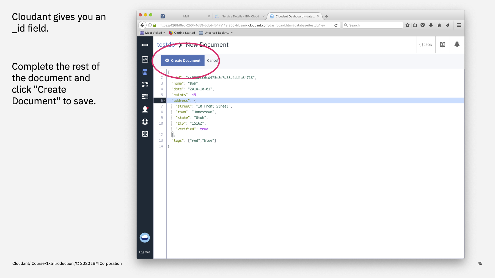

Welcome to the Introduction to Cloudant course, an eighteen part video series that gives you an overview of the IBM Cloudant databases-as-a-service.

---

This is part 6: "The Dashboard".

The easiest way to get started creating databases and adding documents is to use the Cloudant Dashboard.

---

The Cloudant Dashboard is a web-app built into the service. It allows basic data manipulation to be performed through a graphical user interface: databases can be created and deleted, documents added, updated and deleted and replication jobs managed. It is also a handy place to perform one-off queries and to set up secondary indexes (as we'll see later).

It also contains some simple monitoring tools that visualise request rates.

It's important to note that any task that is achievable in the Cloudant Dashboard is also possible with the Cloudant HTTP API - indeed, the Cloudant Dashboard is simply making standard API calls itself 

---

To open a Cloudant service's Dashboard, log into the IBM Cloud, find your Cloudant service and click Launch Cloudant Dashboard button. A new window will pop up, logging you into your Cloudant dashboard.

If you leave the dashboard window unattended for a length of time, you will find yourself logged out (for security purposes) and will have to click Launch again.

---

The dashboard has a number of tabs on the left hand side. Its default tab, "Databases" allows you to list the databases you have created in pages of 20. Each database is shown with the number of documents it is storing and how much disk space is being used. Click on a database name to examine its contents.

---

To create a database, click on the Create Database button and supply the name of the database to create.

---

We now have a new empty database. The database's documents would be listed here in id order, but as this is a new database, there are none. To add a new document, click Create Document.

---

The Cloudant dashboard has created a template document for you with a pre-generated _id. Complete the rest of the attributes yourself to fill out the JSON document and click "Create Document" to save.

---

Now it's time for another practical exercise. Create a new database called "books" and in that database create three or more documents with fields: title, author, date, publisher, ISBN - each representing a book of your choice.

Once created, edit one of the documents, modifying the publication date.

Then delete one of the documents.

---

To summarise:

- The Cloudant Dashboard is a web app app built into the Cloudant service and is part of the CouchDB open-source offerring.
- It is used to manage databases, documents, indexes, queries and replication jobs.
- It can also be used to monitor service throughput.
- The Dashboard is simply an API client - anything that can be achieved with the dashboard can scripted by you using the HTTP API.

---

That's the end of this part. The next part is called ["HTTP API Basics"](./Part&#32;07&#32;-&#32;HTTP&#32;API&#32;Basics.md)
 

---