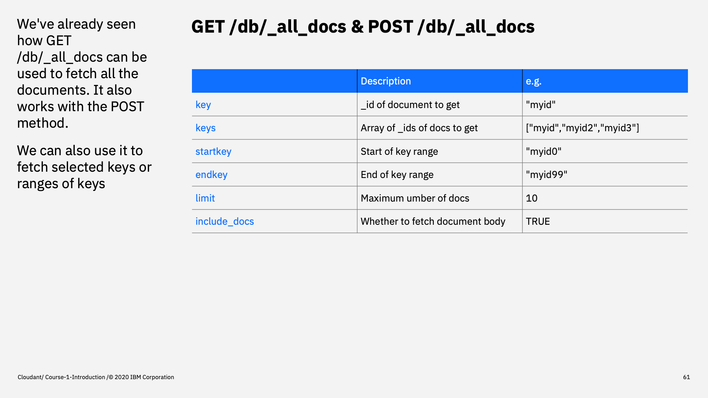
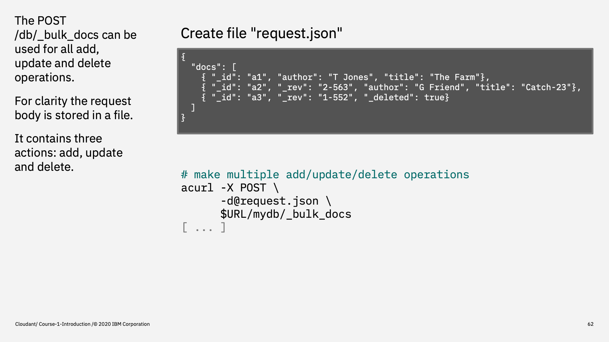
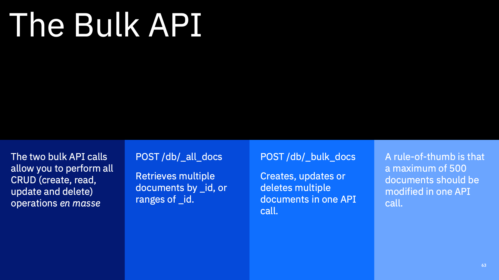

Welcome to the Introduction to Cloudant course, an eighteen part video series that gives you an overview of the IBM Cloudant databases-as-a-service.

---

This is part 8: "The Bulk API".

In the previous part we saw how documents could be easily added updated, updated and deleted singly using the Cloudant HTTP API. In this part, we'll see how two API calls can be used to achieve all of the basic Cloudant operations, with the added benefit of being able to act on more that one document per API call.

---

We've already met the `_all_docs` endpoint - we used it to fetch a list of all the documents in a database, but it has other features too.

- the `key` parameter can be used to specify a single document to fetch, making it equivalent of the `GET /db/id` API call.
- similarly the `keys` parameter takes an array of document ids and will return them all.
- the `startkey` & `endkey` parameters allow you to fetch a slice of the primary index between the supplied limits. Adding `include_docs=true` instructs Cloudant to supply the document bodies too.
- and `limit` allows you to specify how many documents to return in one API call.

---

The `_bulk_docs` endpoint allows multiple insert, update and delete operations to be performed in one API call. It expects an object containing a `docs` array - each element of that array being an operation to perform on a single document. The request body is posted to Cloudant, allowing many operations to be packed into a single API call.

In this example, the first document is an insert: we know this because no revision token is supplied.
The second document is an update to a document because a revision token is supplied with a new document body.
The third document is a deletion. A revision token is supplied, but the body is simply `_deleted: true`, which tells Cloudant to mark the document as deleted.

It's important to note that this isn't like a transaction in a relational database - all or none of these operations could succeed or fail individually. The response data to this request tells you the response for each operation in turn.

---

In summary

With two API calls `_bulk_docs` & `_all_docs` we can perform all create, read, update & delete operations on Cloudant documents and be able to do so in bulk too. `_all_docs` retrieves documents by `_id` or ranges of ids. `_bulk_docs` creates, updates & delete documents in bulk. As a rule of thumb, its recommended that bulk writes are executed in batches of 500; perhaps more than that for tiny documents and fewer than that for large documents.

---

Here's a screen capture of using Cloudant from a command-line terminal:

---

That's the end of this part. The next part is called ["Accessing Cloudant programmatically"](./Part&#32;09&#32;-&#32;Accessing&#32;Cloudant&#32;programmatically.md)
 

---