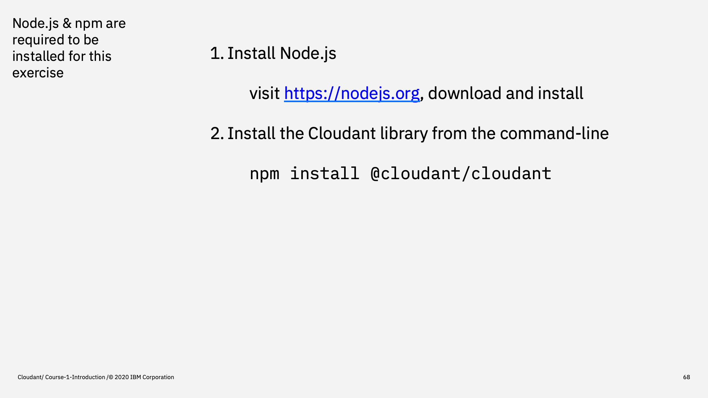
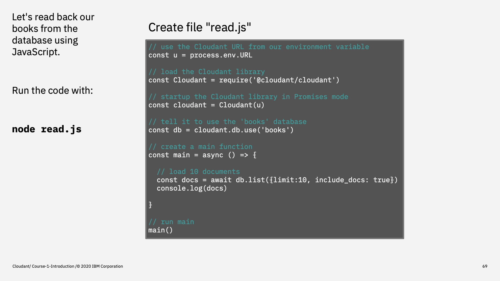
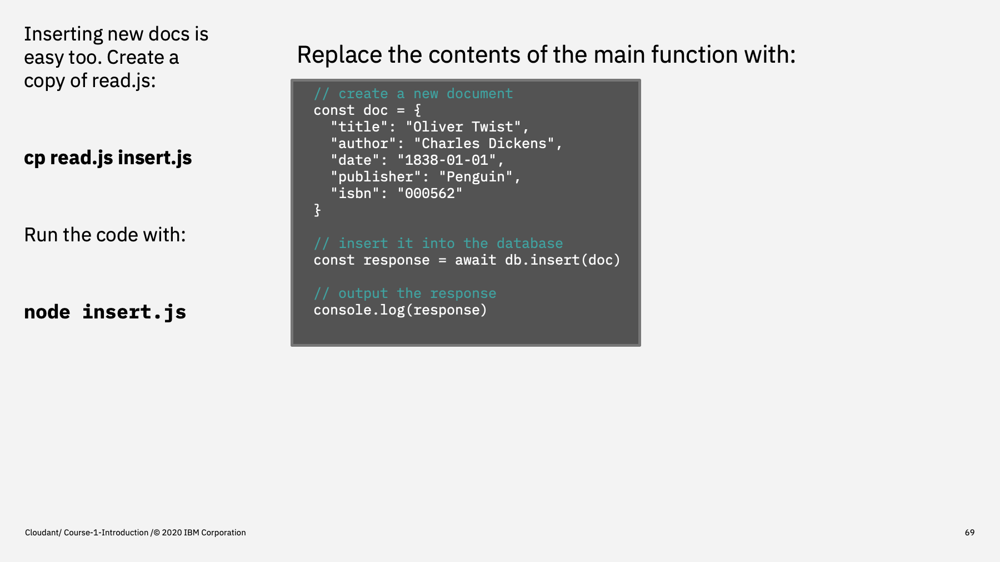
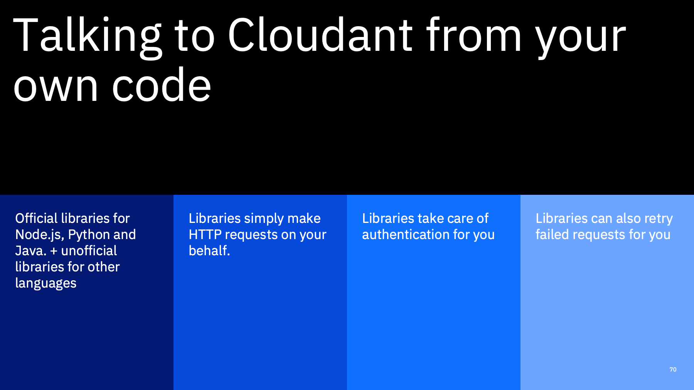

Welcome to the Introduction to Cloudant course, an eighteen part video series that gives you an overview of the IBM Cloudant databases-as-a-service.


---

This is part 9: "Accessing Cloudant programmatically".

So far, our API interactions have either been triggered by the dashboard or via `curl` from the command line. In this section we'll see how Cloudant be accessed programmatically.


---

The examples will use Node.js, so if you want to try the code yourself, you'll need to install `node` & `npm` from [nodejs.org](https://nodejs.org).

We can then install the official Cloudant Node.js library with `npm install @cloudant/cloudant`. (npm is the package manager that comes with Node.js - allowing you to access thousands of open-source projects and build them into your application for free).



---

Once the `cloudant` library is installed we can build some source code. Let's go through this code snippet line-by line:

```js
// use the Cloudant URL from our environment variable
const u = process.env.URL

// load the Cloudant library
const Cloudant = require('@cloudant/cloudant')

// startup the Cloudant library in Promises mode
const cloudant = Cloudant(u)

// tell it to use the 'books' database
const db = cloudant.db.use('books')

// create a main function
const main = async () => {
  
  // load 10 documents
  const docs = await db.list({limit:10, include_docs: true})
  console.log(docs)

}

// run main
main()
```

1. The URL of the Cloudant service is gleaned from the environment variable we created earler.
2. The `@cloudant/cloudant` library is loaded into your Node.js app with the built-in `require` function.
3. We then create an instance of the library configured with the credentials we stored in the first line.
4. We use the `cloudant` object to get a reference to the `books` database and store it in a variable `db`. At this point, we haven't made any API calls - only created data structures that store credentials and which database we are working on.
5. The main function calls `db.list` which maps 1-1 with the `_all_docs` endpoint we saw earlier. The parameters passed to `db.list` should be familiar as the options that `_all_docs` expects to limit the result set and to return document bodies for each id.



---

Here's another code snippet that writes a document.

```js
  // create a new document 
  const doc = { 
    "title": "Oliver Twist",
    "author": "Charles Dickens",
    "date": "1838-01-01",
    "publisher": "Penguin",
    "isbn": "000562"
  }

  // insert it into the database
  const response = await db.insert(doc)

  // output the response
  console.log(response)
```

You can see from the first line that standard JavaScript objects can be used in your code and sent to Cloudant with no conversion, as they turn into JSON natively in JavaScript.

Writing a document is a simply a matter of calling `db.insert` which will map to a PUT/POST API call or to `_bulk_docs`.



---

To summarise

There are official Cloudant libraries for Java, Python and Nodejs. They are thin wrappers around the Cloudant HTTP API - so it's worth understanding the underlying API to get to grips with all the parameters.

The libraries handle two things for you, which are really useful:

1. authentication - exchanging your keys for tokens, whether it be legacy authentication or IAM.
2. retry logic - the libraries can be configured to retry API calls that exceeded your provisioned capacity. If configured this way, they pause and re-attempt the API call multiple times with exponential back-off

Note: retrying such API calls is sensible if you have a temporary and unexpected elevation in traffic, but if you are routinely exceeding your provisioned capacity, no amount of retrying will get the database work done - you need more capacity!



---

That's the end of this part. The next part is called ["Querying"](./Part&#32;10&#32;-&#32;Querying.md)
 


---