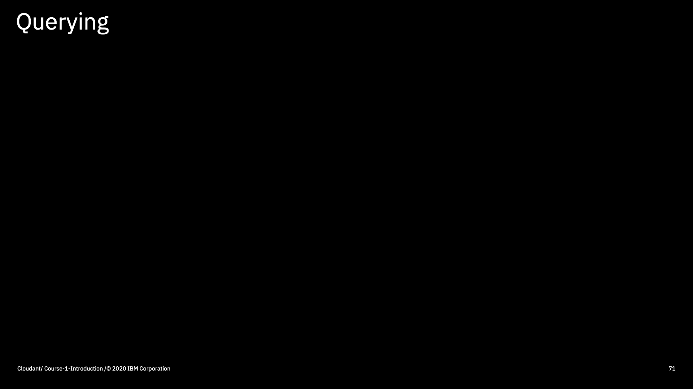
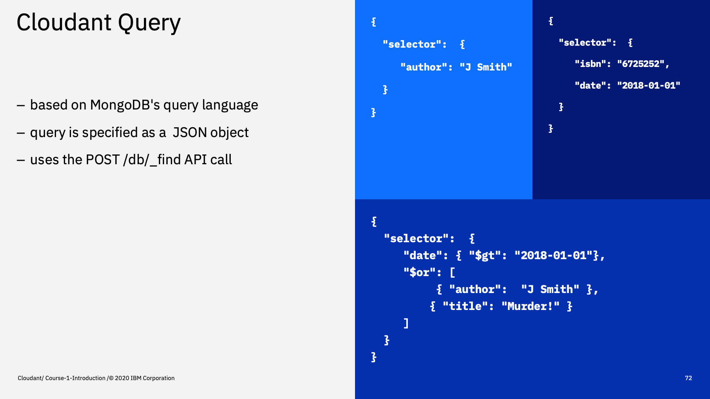
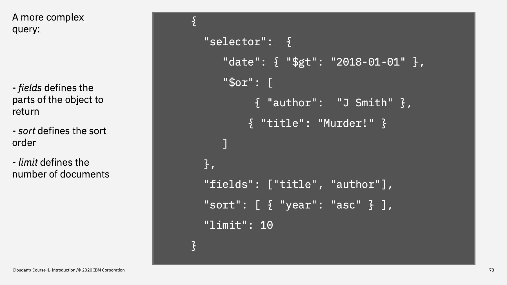
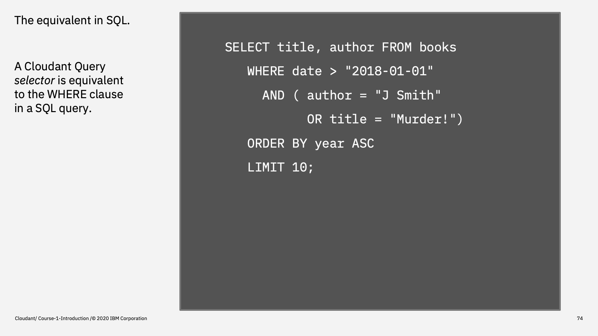
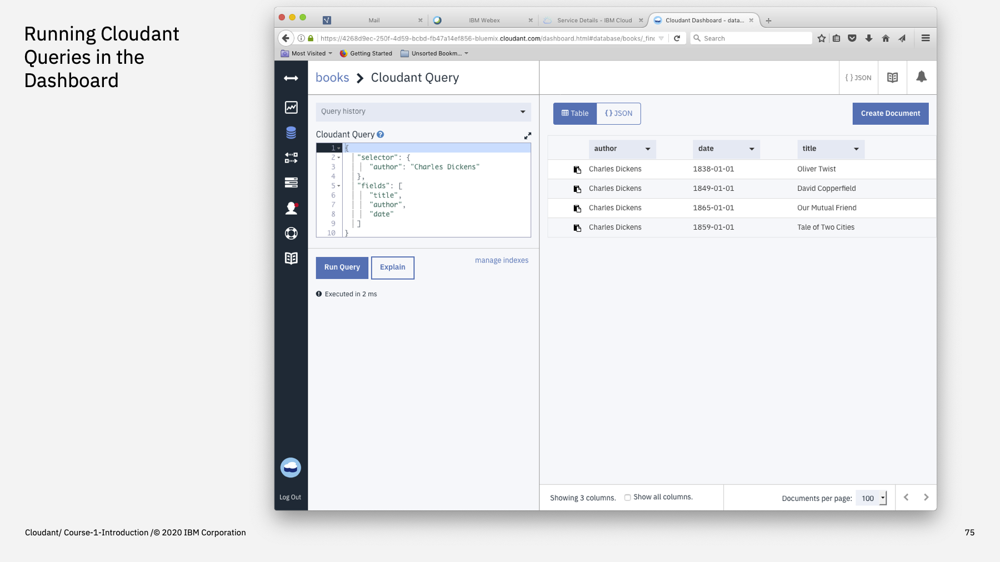
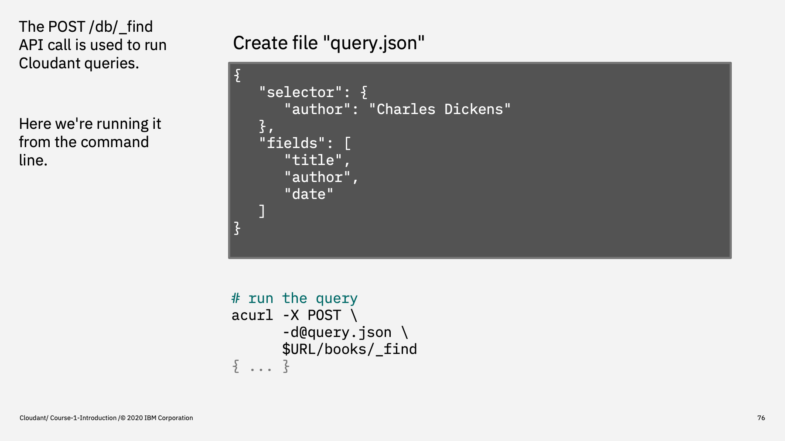
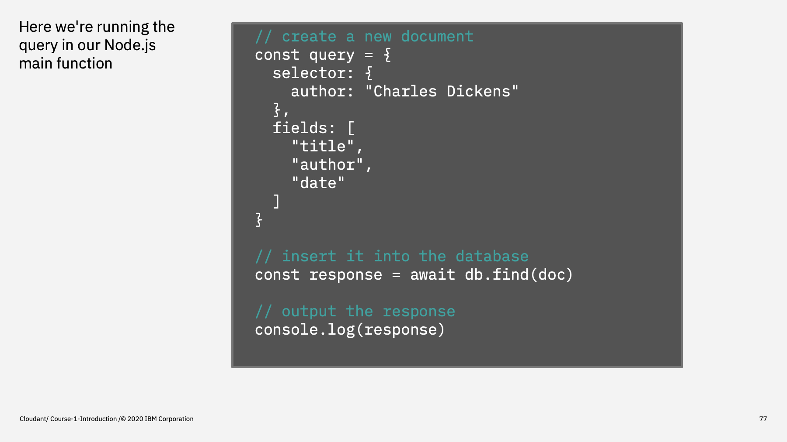
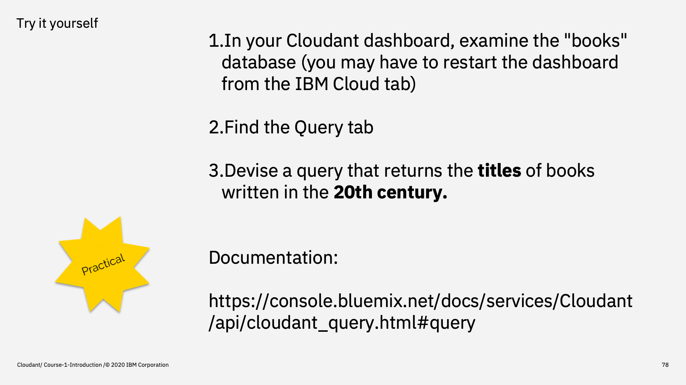
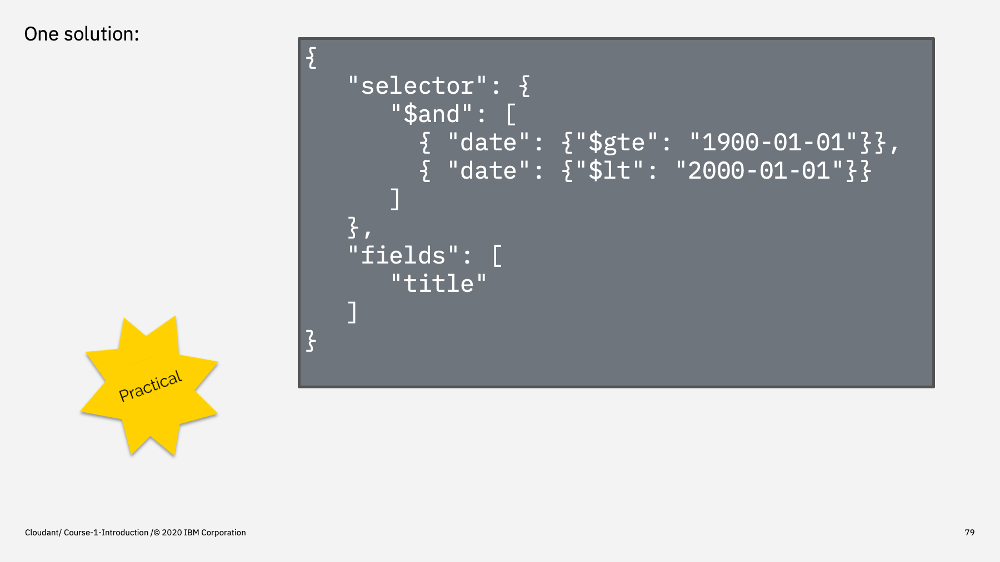
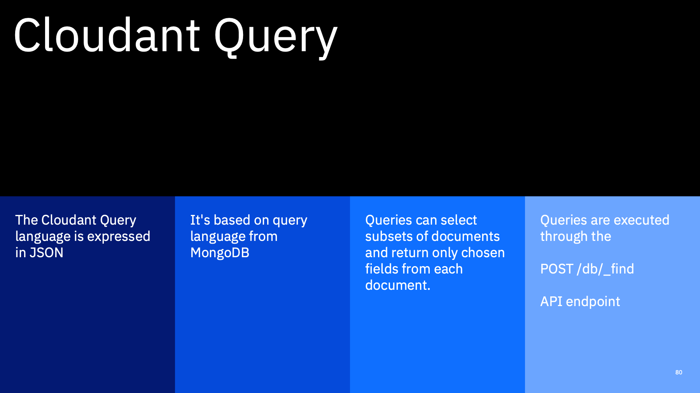

Welcome to the Introduction to Cloudant course, an eighteen part video series that gives you an overview of the IBM Cloudant databases-as-a-service.

---

This is part 10: "Querying".

So far we have done CRUD operations from the command-line, the dashboard and from code. These are operations centred on the document's `_id`:

- fetch document by id
- update document whose `_id` = 'x'
- delete document whose `_id` = 'x'
- get documents in the `_id` range 'a' to 'z'

These operations are the building blocks of a database but they only get you so far. What if you need to return a sub-set of documents matching on fields *within* the document. A person's birth date? A book's title? An order's value?

This is where Querying comes in....

There are several methods for querying data in Cloudant. The first we'll look at is called "Cloudant Query".

---

Cloudant Query's language was inspired by the MongoDB query language. Queries are expressed in JSON, where the "selector" attribute describes the subset of data to return. The query JSON is posted to the database's `_find` endpoint to perform a query.

The simplest form of query is finding documents where an attribute has a fixed value e.g. where author == J Smith.

The second example shows two clauses in the query, both of which must be satisfied for a document to make it into the search results. e.g. where isbn === 6725252 AND date = 2018-01-01

The third example shows how logical operators can be added. The '$gt' operation means "greater than" (there's also gte for greater than or equal to, and lt/lte for the equivalent less than comparators). The `$or` operator is an OR operation, so a matching document must have  a date greater than the one in the query an either an author of J Smith OR title of Murder!.

Note: if you need to access objects within documents, you can use standard "dot notation" e.g address.zipcode to access a zipcode string inside an address object.

---
We can also add 

- "fields" - to specify the document attributes we want returned (the default is the entire document.
- Sort – to define how the data is to be sorted. Sort is an array, allowing the sort to be calculated on multiple attributes.
- Limit – the number of documents to return

If you are from a relational database background, this is the equivalent SQL query to that last Cloudant query example.

---

If you are from a relational database background, this is the equivalent SQL query to that last Cloudant query example. The WHERE clause is the equivalent of SELECTOR in Cloudant Query, ORDER and LIMIT are exactly equivalent and the Cloudant Query FIELDS is handled in the list of fields listed after the SELECT keyword.

The JSON syntax may take a bit of getting used to, but MongoDB users should find it familiar.

---

Cloudant queries can be executed in the Cloudant Dashboard. Select the database you are working with e.g. `books` then choose the `Query` tab.

Enter your Cloudant Query JSON in the box provided and click Run Query when you're ready. The result set will appear on the right-most panel.

Note: the `Explain` button is used to provide an explanation on how the database interprets the supplied query. This becomes more important when we get to Indexing in the next part.

---

Queries can also be triggered from `curl` too. The Query JSON, in this case, is stored in a file and POSTed to the `_find` endpoint using the `-d@` command-line syntax.

---

The Node.js codes is very similar. The Query is a standard JavaScript object which is passed to the `db.find` function which is POSTs to the `_find` endpoint on your behalf.

---

Now time for a practical exercise. Devise your own Cloudant Query that finds the titles of books _written in the 20th Century_. The Cloudant Query documentation is [here](https://console.bluemix.net/docs/services/Cloudant/api/cloudant_query.html#query
) if you need it.

Pause the presentation here if you don't want to know the answer...

---

Here's one solution:

I'm using the `$and` operator to combine two clauses on the `date` attribute. One clause to locate documents whose date `>=` 1900, the other to find documents whose date is < the year 2000. Both clauses have to be true to select a document. As we only need the `title` of the matching books, we can supply a `fields` attribute instead of being returned the entire document.

---

To summarise

Cloudant Query is a query language inspired by MongoDB where the syntax is expressed in JSON form.

Queries select subsets of documents from the database, using clauses operating on data inside the document - not just the document's `_id`.

Queries are sent to the database's `_find` endpoint, either programmatically, using curl or via the Dashboard.

The query's selector decides which cut of data is required, 

---

That's the end of this part. The next part is called ["Indexing"](Part\ 11\ -\ Indexing.md)
 

---