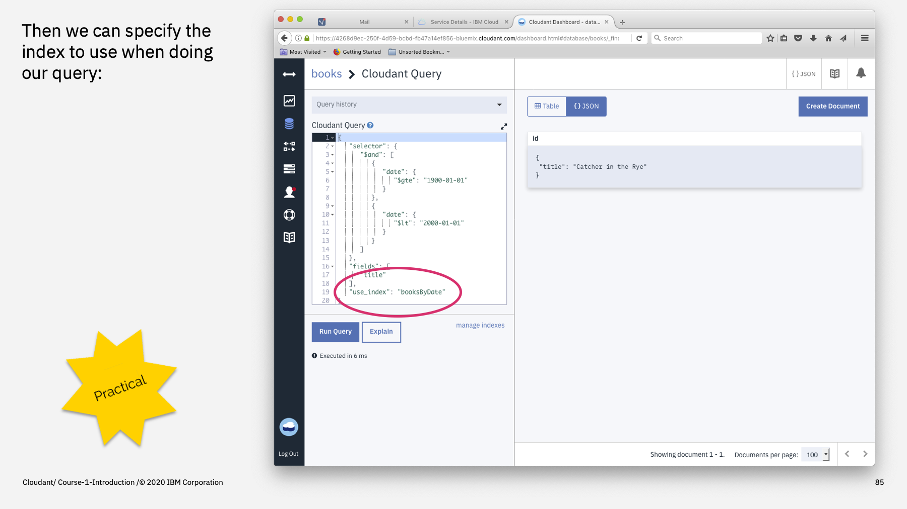

Welcome to the Introduction to Cloudant course, an eighteen part video series that gives you an overview of the IBM Cloudant databases-as-a-service.


---

This is part 11: "Indexing".

The queries we executed in the previous part were not optimal: to get the answer, Cloudant had to spool through every document in the database in turn to see if it met with the search criteria.

To make queries run in a performant and scalable way, we need "Indexing".


---

Cloudant allows you to specify any number of "Indexes" (or, indicies). 

An index is a secondary data structure built from the document list. It contains data sorted by the fields you specify e.g. books sorted by date and title. If you perform a query asking for data mathcing a document's date & title, the indexed data structure can be used to speed up the query process: instead of scanning through every document in turn, Cloudant can jump to the relevant part of the index (say, the section on 20th century books) and retrieve the data much more quickly.

There are two types of Cloudant Query indexes: type=json & type=text, which are backed by two underlying indexing technologies we'll meet in subsequent parts of this course.

An index is defined by POSTing some JSON to a database's `_index` endpoint. 

```js
{ 
  "index":  {
     "fields": ["date"]
  },
  "name": "booksByDate",
  "type": "json"
}
```

The `index` object contains a `fields` array which specifies which document attributes to index. As a rule of the thumb, the fields that need indexing are usually equivalent to the attributes used in the "selector" of a query you're going to use to retrieve the data. i.e. if you need to query by the `date` field, we need to index the `date` field.

Although the "name" of an index is optional, it's good practice and we'll follow this convention. It's good to ask Cloudant a question and specify the name of the index you intend it to use. This saves Cloudant from having to choose which index it should use from those available and it makes it easy for you to remember which index is which.


---

Let's create an index on our books database from the dashboard. Select the database, then choose the "Design Documents" tab and "Query Indexes" from the pop out menu.


---

Any existing indexes are listed on the right-hand side: there should be a "special" index representing the primary index, based on the document's `_id`. 

Complete the index definition with the JSON:

```js
{ 
  "index":  {
     "fields": ["date"]
  },
  "name": "booksByDate",
  "type": "json"
}
```

and click "Create Index" when you're done.

Clicking the button sends a `POST` request to the `_index` endpoint (other API calls are available to update and delete existing indexes).

Note: indexes are built asynchronously by Cloudant in the background. For large databases, it may take Cloudant some time to construct the index for the first time. The index will not be able to use until that initial build is ready.


---

We can repeat our query for books in the 20th century, this time specifying the index name with the `use_index` field and the answer should return, this time powered by our index. You may not notice a speed improvement for a very small database, but the benefit is definitely felt as your data size and query volume grows. Indexing helps your queries remain performant as your application scales.



---

When you tell Cloudant to create a secondary index, it starts a background task looking at all the documents in turn and creates a new data structure on disk: the index. The index is a balanced tree which pairs the keys (the attribute or attributes you need indexed) with the document `_id` they came from.

The index can be used to efficiently look up known keys and ranges of keys without having to rescan the entire database.


---

There is another trick that can be employed at index time: the _partial filter_. You may optionally supply a _partial filter_ in your index definition, and this Cloudant Query selector will be executed at _index time_ to decide which documents' data make it to the index and which are ignored. 

In this example, a selector is employed that only allows dates that fall on a weekend to make it to the index. Smaller indexes are faster and more efficient, so if you have a use-case that only needs a subset of the data to be indexed, e.g. only completed orders, or only expired accounts, or only published blog posts, then a _partial filter_ selector at index-time can help to make the index smaller and more efficient.


---

To summarise:

Indexing is used to speed up queries by using a pre-built data structure (the secondary index) to help look up keys and key ranges from values inside the document body more efficiently. Without an index, queries won't scale in a performant manner as data size and query volumes increase.

The `_index` endpoint is used to define the index and an optional partial filter can be applied at query time to make smaller, sparser indexes.


---

That's the end of this part. The next part is called ["MapReduce"](./Part&#32;12&#32;-&#32;MapReduce.md)
 


---