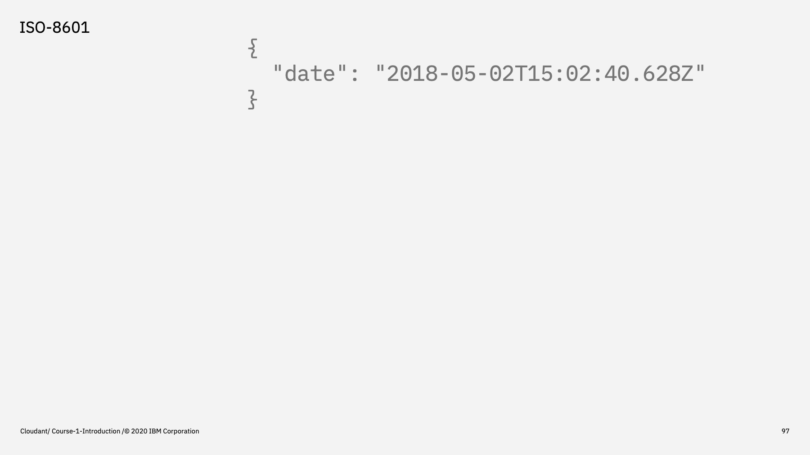
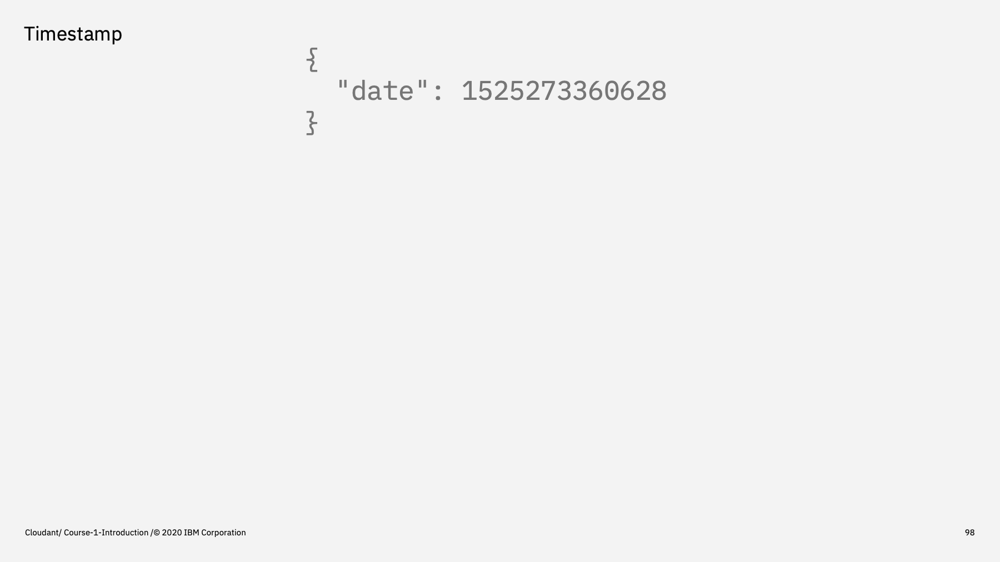
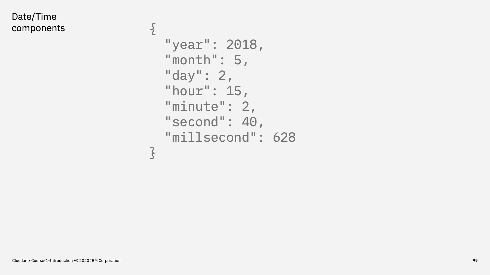
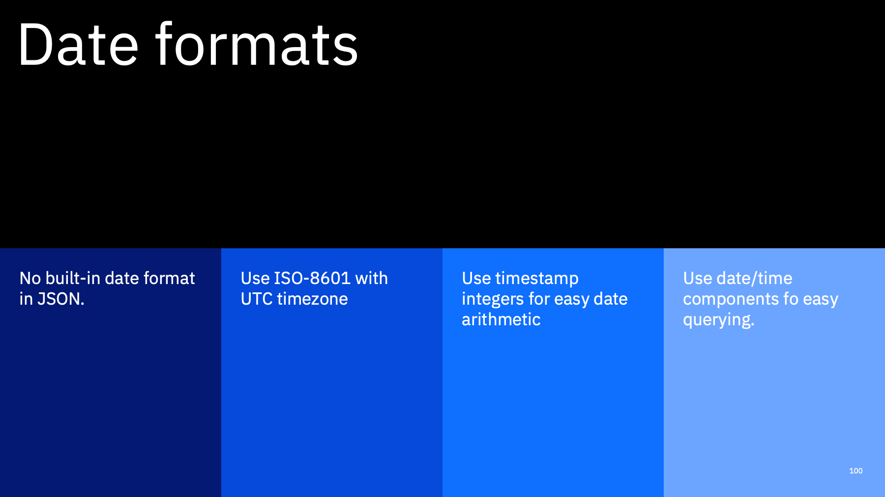

Welcome to the Introduction to Cloudant course, an eighteen part video series that gives you an overview of the IBM Cloudant databases-as-a-service.

---

This is part 13: "Dates".

We saw earlier in this course that JSON only natively models strings, numbers, booleans, objects & arrays. A common use-case is to store a date or date/time value in a database. Here's some ideas on how that can be achieved with Cloudant.

---

The ISO-8601 string format for representing a time time consists of a `y-m-dTh:m:s.msTIMEZONE` year, month, day, a 'T' characetr, hour, minute, second, millisecond and timezone. 

I always recommend storing dates in the UTC timezone even if collecting data from different geographies. Date stored in this form can easily be transformed into the local timezone at the front end, but it's usually important to store each user's data in the "same units".

This string format sorts into date/time order (because the most significant date units are at the front of the string) and can be easily parsed in MapReduce functions

---

Another option is to store the number of milliseconds since 1970-01-01. This too is a standard, machine-readable way of representing a date & time.

It too can be parsed in MapReduce functions and is very handy for comparing two dates: simply take one timestamp from another.

---

The third option is to store each date/time component in separate fields. This is more verbose than the previous options but has one key advantage if you're using Cloudant Query. Because Cloudant Query can only act upon data in the form it exists in the document itself, if you need to query on a single date component e.g the month, then you'd need that item broken out in the document.

---

To summarise:

There's no native date format in JSON so you can store dates and times how you like. ISO-8601 is compact, readable and sorts nicely. As does a timestmp (milliseconds since 1970). 

If you need to use Cloudant Query on one of the component parts, then that would need to be broken out explicitly in the document.

---
That's the end of this part. The next part is called ["Replication"](./Part&#32;14&#32;-&#32;Replication.md)
 

---