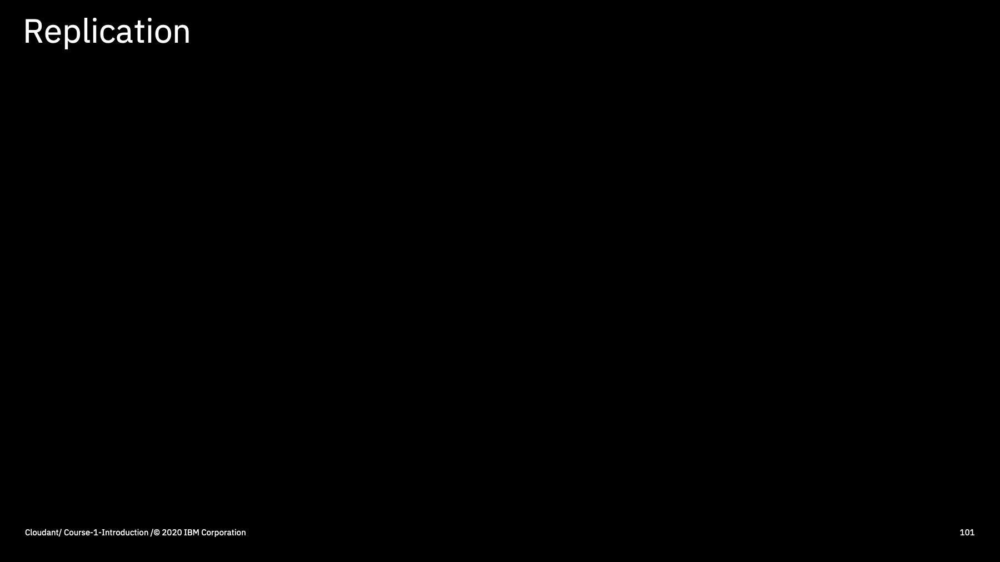
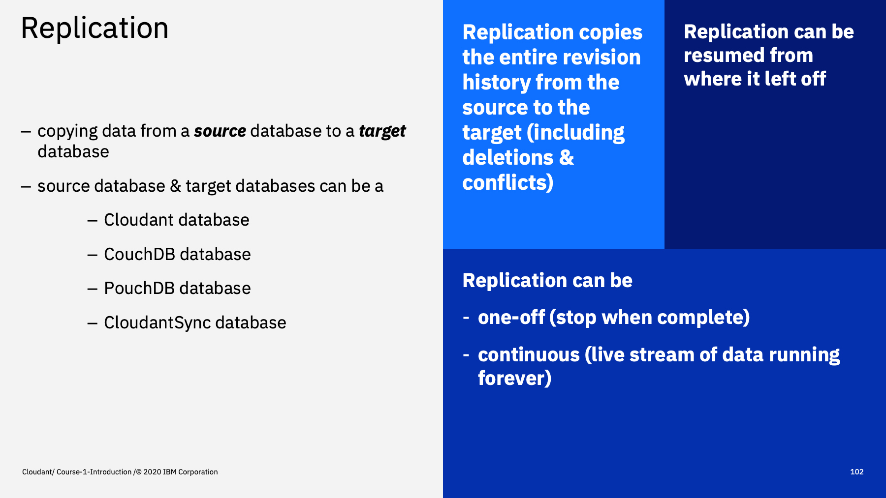
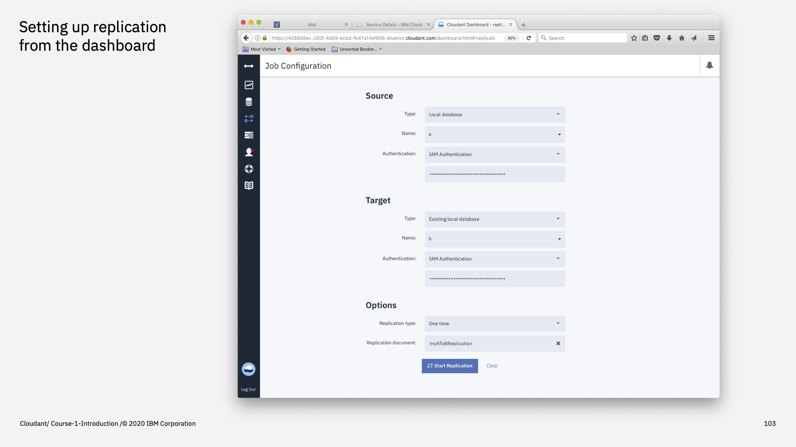
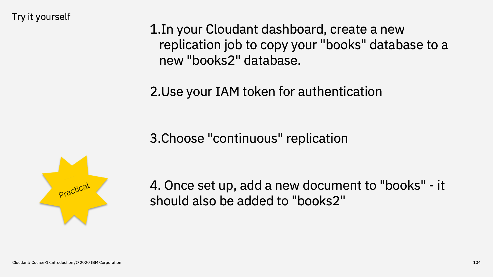
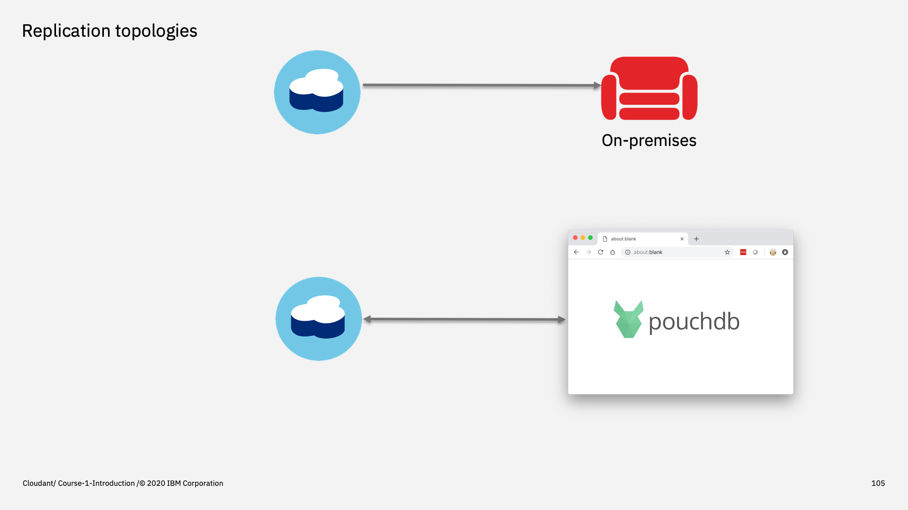
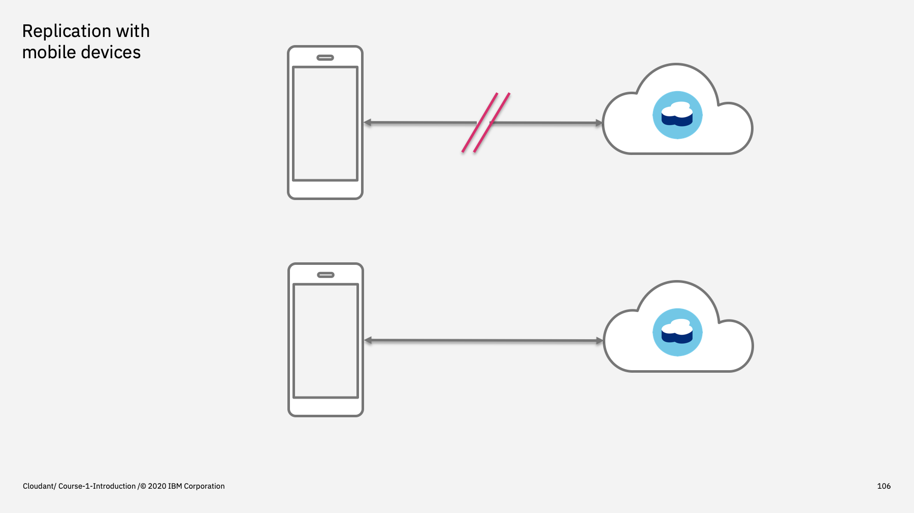
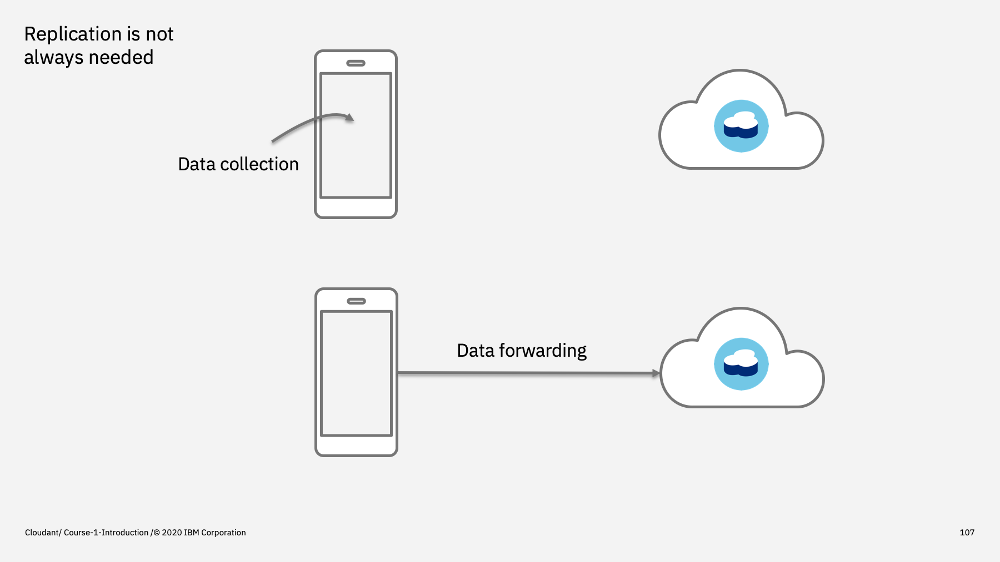
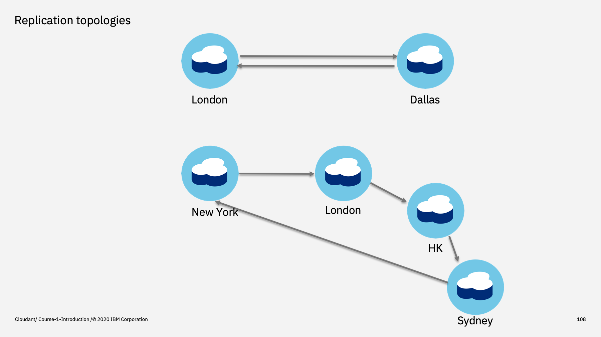
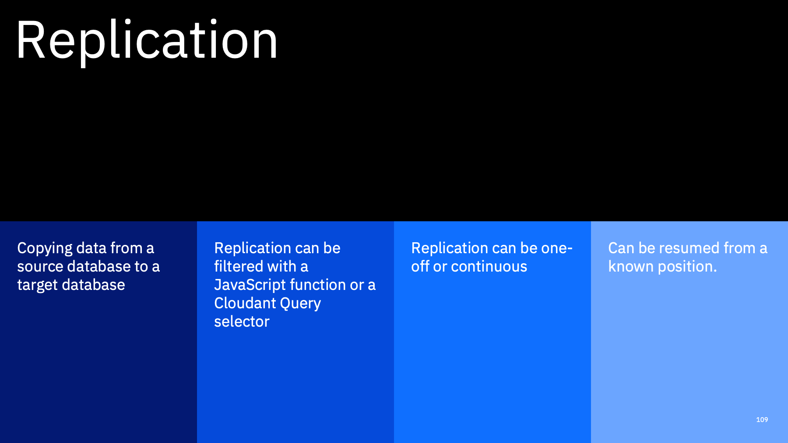

Welcome to the Introduction to Cloudant course, an eighteen part video series that gives you an overview of the IBM Cloudant databases-as-a-service.

---

This is part 14: "Replication". 

---

Replication is a core feature of Cloudant. It is the transfer of data from one database (the source) to another (the target).

The source and target databases can reside on the same Cloudant service, or be geographically separated, for example a US Cloudant database replicating to one in Europe.

The replication protocal is shared with Apache CouchDB, so replication is often used by enterprises copying data from a cloud-based database to one running CouchDB in their own premises.

PouchDB, a JavaScript-based CouchDB clone that runs in Node.js stacks or in the web browser can also be used to replicate data to or from Cloudant.

And there is the Cloudant Sync libraries, which allow native iOS or Android apps to sync data to and from a Cloudant service.

Replication is a one-way operation from source to target which moves all data (deletions, conflicts, attachments as well as documents) and can be triggered in one of two ways:

1. to run until all the data from the source has reached the target and then stop, or
2. the same as one but to keep the replication running continuously forever, transferring new data from the source to the target as it arrives.

Replication can also be resumed from where it last left off. Cloudant keeps a note of "checkpoints" between replicating parties to allow the resumption of a pre-existing replication from its last known position.

---

There is a replication tab in the Cloudant dashboard. A replication is started by specifying the source & target databases including authentication credentials, and whether this is a one off or continuous operation.

A replication can also be given a name, which is handy for tracking which replication job is which.

---

Now it's time for a practical exercise.

From your Cloudant dashboard:

- create a new database called `books2`
- start a continuous replication from `books` --> `books2`
- visit the books2 database to check that documents from books is now in books2
- add a document to the books database - check the change makes it to the books2 database

---

Replication can be used to move data from a Cloudant database to an on-premise CouchDB instance. The replication can be controlled bt the Cloudant or the CouchDB end i.e you can ask Cloudant to send its changes to CouchDB or you can ask CouchDB to pull the changes from Cloudant. Bear in mind that the replication controller must have network visibility of both HTTP APIs.

PouchDB also speaks the same replication protocol so can be used to transfer data to and from PouchDB & Cloudant. It's most likely that PouchDB would be the replication controller in this case.

---

PouchDB is commonly used to create _offline first_ apps which collect data even when not connected to the interent and then write data to Cloudant when they come back online, giving their users an _always on_ service.

---

Bear in mind that replication may not always be required. If your application needs to store data and then write it to Cloudant later, then replication isn't strictly speaking required. All that is required is that data is stored on the device and bulk written to Cloudant when the connection is restored. 

---

As replication is a one way operation, if a master-master setup is required between two Cloudants in different regions, then two replications in opposite directions are required.

Changes occurring on the London side are sent to Dallas, and vice versa.

More complex topologies are possible, with data flowing in a ring around a set Cloudant services. 

---

To summarise:

Cloudant replication is a mechanism for copying data from a source database to a target database. 

Replications can be one-off or continuous and can optionally be filtered with a JavaScript function or Cloudant Query selector and can be resumed from where a previous replication left of.

---

That's the end of this part. The next part is called ["Partitioned Databases"](Part\ 15\ -\ Partitioned Databases.md)
 

---