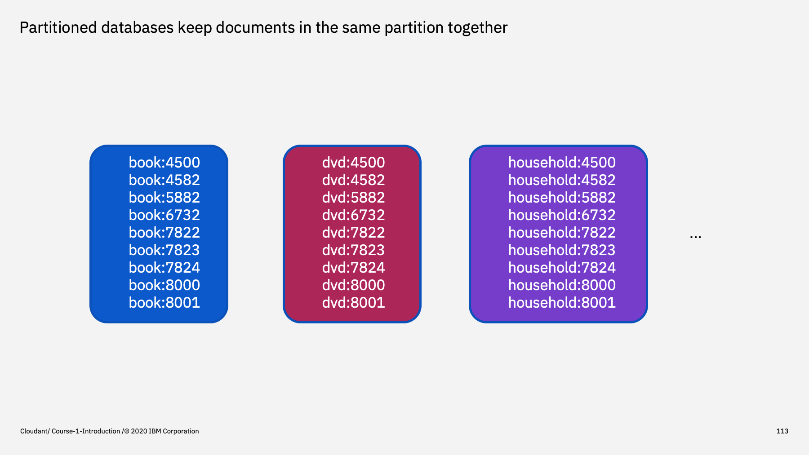

Welcome to the Introduction to Cloudant course, an eighteen part video series that gives you an overview of the IBM Cloudant databases-as-a-service.

---

This is part 15: "Partitioned Database". 

We haven't discussed this yet, but Cloudant is a distributed database. There are many storage nodes that make up a Cloudant service and a database's documents are distributed across the nodes in groups called "shards". A single database is said to be "sharded" or divided into multiple pieces.

In a normal Cloudant database, a document is allocated a shard algorithmically - effectively documents are distributed around the the shards randomly. 

In a partitioned database, you define which shard the documents are stored in by supplying a _partition key_.

---

Partitioned databases are created with the same `PUT /<database name>` API call but with an additional query string parameter: `partitioned=true`

In the first example the `products` database is created as a partitioned database, in the second example as a standard, un-partitioned database.

---

When adding documents to a partitioned database you _must_ supply a document `_id` - (there are no auto-generated document `_ids`). A document `_id` has two parts, separated by a colon character:

1. the partition key - a string which defines on which _partition_ to store the document.
2. a document key - a string that uniquely identifies a document within the partition.

In the top example a book is being added into the `book` partition of the products database.

Then another document is being added into the `dvd` partition and a third into the `household` partition.

---

The effect of this is that documents sharing a partition key reside in the same shard of the databases. Documents in the same partition are stored together in document key order.

---

The advantage comes when retrieving data. We can direct Cloudant Queries, MapReduce requests and searches at _a single partition_. In this example, a Cloudant Query selector is being sent to the `book` partition. This has the effect of only exercising a fraction of the Cloudant infrastruture (only the shard that hosts the `book` partition are used, the rest of the cluster remains idle).

This makes for faster query performance, cheaper query costs and better scalability.

The key to great partitioned query performance is the choice of partition key:

- It needs to be a value that repeats within your data set i.e. there a several items in the `book` partition.
- There needs to be many partitions. If there are only a handful of categories, then category is a bad choice of partition key. It needs to be something that has many values e.g. deviceId in an IoT application or orderId in an e-commerce system.
- It needs to match the queries that your application is making. If the most common use-case is searching within a product category, then partitioning by category may be a good fit.
- Avoid hot partitions - traffic should be evenly spread across your partitions. If your choice of partition key is likely to lead to much more traffic hitting a small number of partitions, then this makes for a poor choice of partition key.

---

To summarise

Partitioned databases are created with the `partitioned=true` flag and documents have a two part id where the partition key and document key are joined by a colon character.

Documents in the same partition are stored in document key order in the same database shard. Knowing this, we can make queries directed at a single partition that run faster and more cheaply.

Note: it's still possible to query across partitions in a partitioned database. When creating a secondary index, you choose whether its purpose is for per-partition or global scope.

---

That's the end of this part. The next part is called ["Cloudant Search"](./Part&#32;16&#32;-&#32;Cloudant&#32;Search.md)
 

---