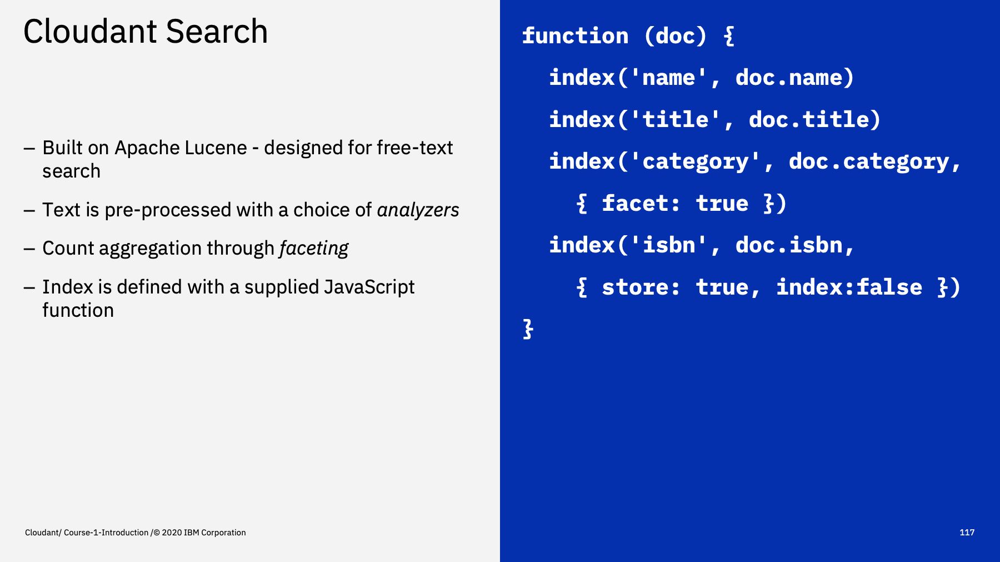
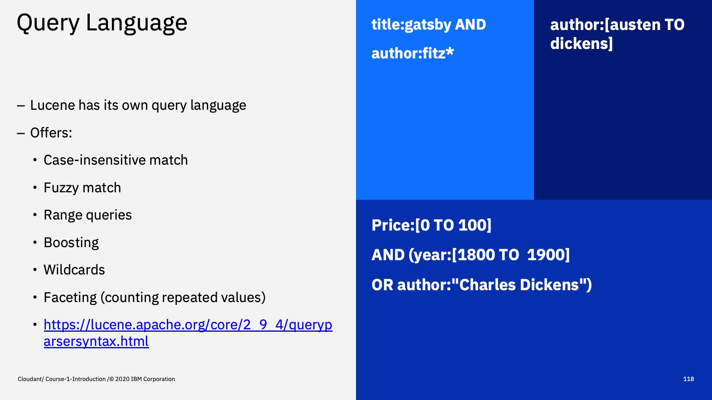
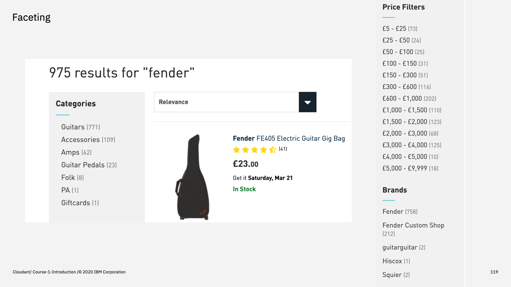
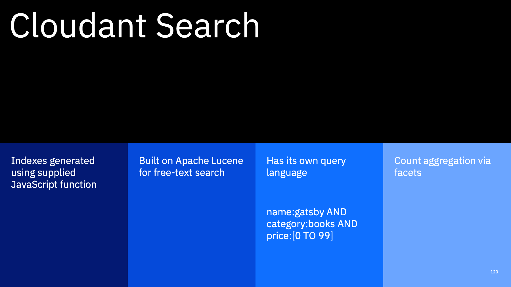

Welcome to the Introduction to Cloudant course, an eighteen part video series that gives you an overview of the IBM Cloudant databases-as-a-service.

---

This is part 16: "Cloudant Search". 

There is another method of querying and indexing in Cloudant called _Cloudant Search_ which we'll briefly explore in this part.

---

Cloudant Search is built on another open-source project, [Apache Lucene](https://lucene.apache.org/), which powers the search capabilities of many products including ElasticSearch.

It is primarly designed for _free text_ search, where blocks of text are pre-processed before being indexed: removing case, punctuation, common noise words and trimming common language-specfic word endings e.g. farmer becomes farm and farms becomes farm.

This text-processing is performed by a choice of _analyzers_ at query time, prior to searching. 

It also allows some aggregation functionality using a technique called _faceting_ as we'll see.

A Cloudant Search index is created by supplying JavaScript function, not unlike MapReduce except this time the `emit` function is replaced by an `index` function, which expects the name of the field, the data itself and some options.

In this example, the document's `name` and `title` are indexed with default options. The category is nominated for `faceting` (the aggregation functionality) and the `isbn` is stored in the index but not _indexed_ for search itself. Sometimes it is more efficient to store some items in the index rather than doing `include_docs=true` at query time.

---

Lucene has its own [query language](https://lucene.apache.org/core/2_9_4/queryparsersyntax.html) allowing you to create queries that match combinations of clauses with logic, fuzzy matching, ranges and term boosting.

Here are some examples:

1. Find documents whose title matches 'gastby' and whose author starts with 'fitz'. Notice the asterisk wildcard.
2. Find documents whose author is in the range austen --> dickens. This is an example of range querying on a string field.
3. Find documents whose price is between 0 and 100 AND whose year is in the 19th century or whose author matches "charles dickens". This shows how logic can be built into queries.

Cloudant Search is useful not only for free-text search, but for when you know which attributes you are going to search on, but the queries are varied, with different combinations of attributes each time. This flexibility is difficult to implement with fixed-order MapReduce indexes.

---

Faceting is a form of aggregation. You nominate individual indexed fields for faceting at index-time and activate the aggregation with paramaters at query-time.

It has two uses:

1. Counting repeating values in the result set, such as the counts of products that belong to each category in a result set. or,
2. Counting numbers of items in numeric ranges, such as the product counts in each of the price ranges.

Both of these forms of counts can be presented to a front-end user as a menans of further filtering an existing search, to narrow the scope of the search. e.g a customer searches for Fender, then clicks on Amps then on a price range under $500. All of this search and filtering can be powered by Cloudant Search.

---

To summarise:

Cloudant Search indexes are defined with a supplied JavaScript function. They are built on Apache Lucene and are primarily used for free-text search matching, but the query language is useful for building flexible queries on a fixed set of indexed fields. It also has some powerful counting aggregations suitable for drilldown user interfaces.

Note: Cloudant Search also powers 'type=text' Cloudant Query indexes, so a subset of its capabilities is surfaced using the `_find` API.

---

That's the end of this part. The next part is called ["Geospatial"](./Part&#32;17&#32;-&#32;Geospatial.md)
 

---