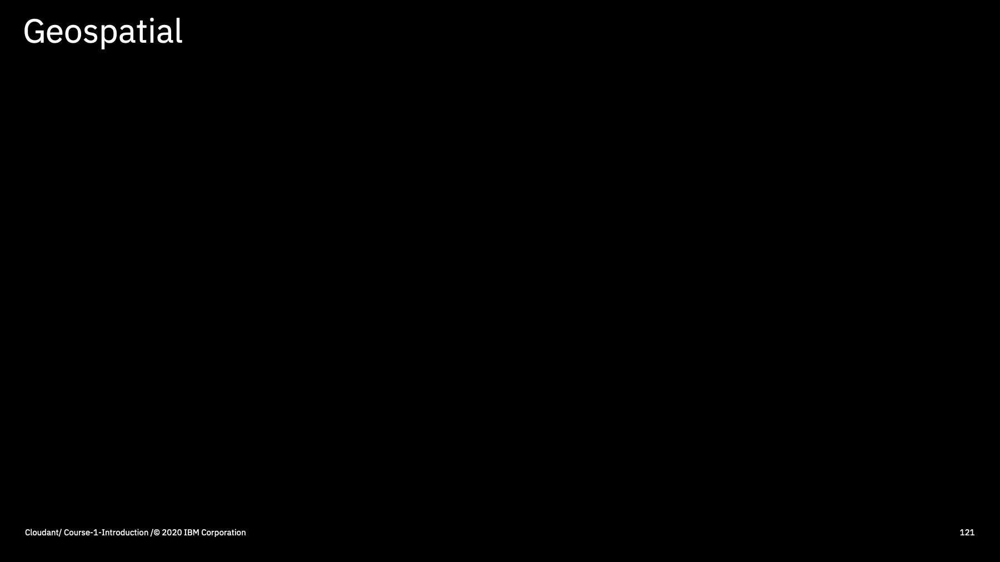
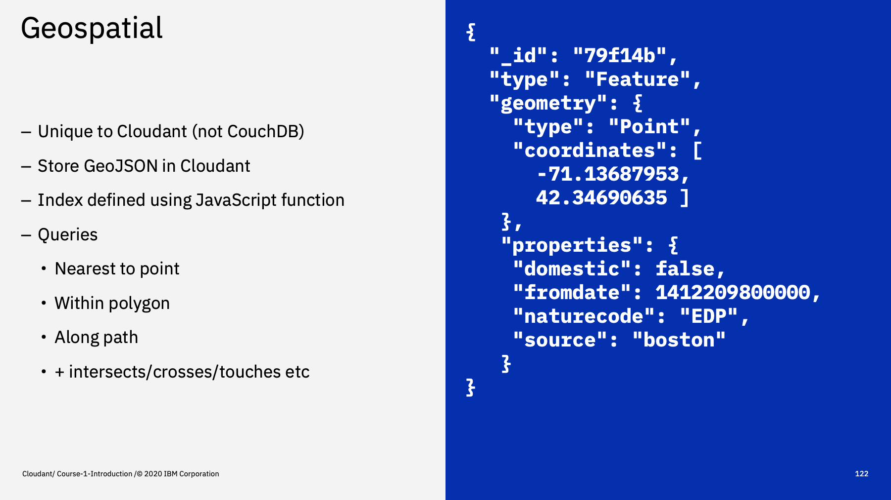
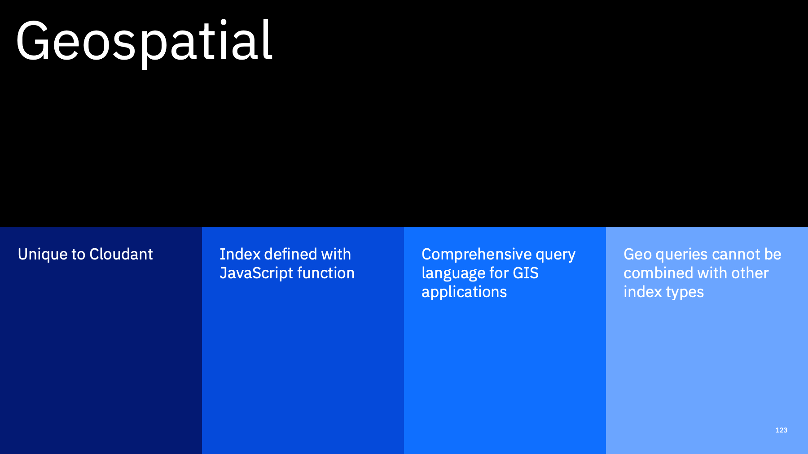

Welcome to the Introduction to Cloudant course, an eighteen part video series that gives you an overview of the IBM Cloudant databases-as-a-service.

---

This is part 17: "Geospatial". 

The final means of querying data in Cloudant is using _geospatial indexes_.

---

Geospatial indexes are unique to Cloudant - you won't find them in the CouchDB codebase. 

Data is stored as [GeoJSON](https://geojson.org/) in the Cloudant database to describe point, line, polygon, multi-point, multi-line and multi-poloygon objects. Each object, as well as the geographic information, can have optional _properties_: meta data about the object which are returned in the search results.

Again an index is defined as a JavaScript function and then queries can be used ask questions of your collection of geographic features e.g. find me the nearest object to this point, find objects within this polygon, find objects along this path, find objects that intersect with this object.

---

To summarise

Cloudant Geo is something unique to the Cloudant service and is used to perform advanced geospatial queries against your databases of GeoJSON objects. It cannot be combined with other index types so is only of use to Geographic Information Systems or use-cases that have a purely geographic purpose.

---

That's the end of this part. The next part is called ["Under the hood"](./Part&#32;18&#32;-&#32;Under&#32;the&#32;hood.md)
 

---